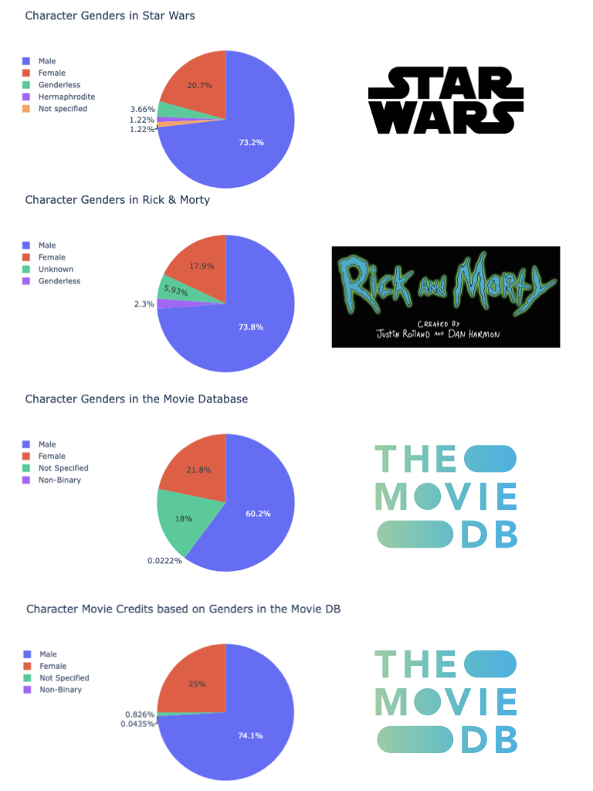

# Gender Imbalance in Movies 

This is a quick study of gender inequality in movies. In particular, I collected gender data from [Star Wars](https://swapi.dev/api/), [Rick and Morty](https://rickandmortyapi.com/api/), and [The Movie Database](https://api.themoviedb.org/3/) (Requires key) APIs. Surprisingly, a **Female:Male** ratio of **1:3** prevails. 

The same ratio is observed for total credits for each character. (Note that I only collected the first 10000 characters from the Movie Database).

There is of course real analysis on gender gap in movies [here](https://www.nature.com/articles/s41599-020-0436-1) showing improvement over time.

In this repo:

* **conf_api.ini** has the endpoints and specifications for the APIs.
* **api_funcs.py** has the connectAPI class.
* **make_dashboard.py** connects to  the APIs, get data and create a dashboard with pie charts as seen below.
* **film_gender_imbalance.ipynb** has further analysis and visualizations. Unfortunately, the plotly graphs did not render properly here at GitHub, but it can be viewed [here](https://nbviewer.org/github/saevrenk/gender_imbalance/blob/main/film_gender_imbalance.ipynb)

https://user-images.githubusercontent.com/105816821/223281365-f848b04b-d952-45bd-9fed-3d4429424750.mov